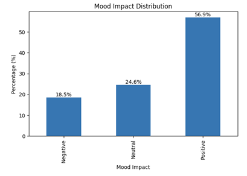
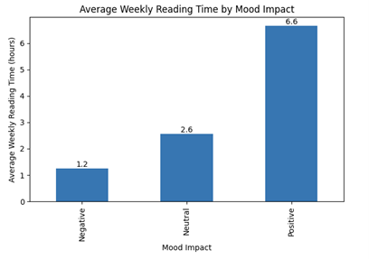
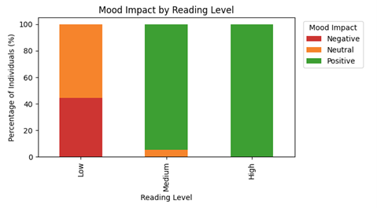
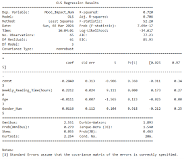
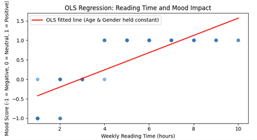
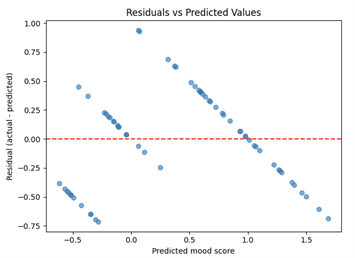

# Exploring the Relationship Between Reading Habits and Mood
## Project Overview
This project investigates whether weekly reading time is associated with self‑reported mood outcomes, and whether this relationship holds once age and gender are taken into account. The analysis uses a publicly available dataset and follows a structured data science workflow, including data preparation, exploratory analysis, and regression modelling.

The findings suggest a clear positive relationship between reading time and mood. Individuals who report higher weekly reading time tend to report more positive mood outcomes, while demographic factors such as age and gender appear to play a more limited role within this dataset. Results are interpreted cautiously and focus on association rather than causality.

## Dataset
The dataset used in this project was sourced from a publicly available Kaggle repository and contains anonymised information on individuals’ reading habits, demographic characteristics, and self‑reported mood outcomes. 

Key variables include weekly reading time, mood impact (categorised as negative, neutral, or positive), age, gender, and preferred book genre. The dataset is cross‑sectional and represents a single snapshot in time. 

As the data is publicly available and fully anonymised, there are no confidentiality or privacy concerns. This makes the dataset well suited to exploratory analysis and regression‑based modelling. 

## Data Source
The dataset used in this project is publicly available and was sourced from Kaggle:

[Reading Habits and Mood Impacts](https://www.kaggle.com/datasets/hanaksoy/reading-habits-and-mood-impact-dataset)

## Analysis Notebook
The full analysis for this project was carried out in a single notebook, including data preparation, exploratory analysis, regression modelling, and diagnostic checks. 

The notebook is included in this repository: 

[Analysis Notebook](https://github.com/BlossomInsights/Reading_Mood_Analysis/blob/main/reading_mood_project.ipynb)

## Tools Used
This project was implemented using Python within a Kaggle Notebook, a cloud‑based, Jupyter‑compatible environment that supports reproducible data analysis and visualisation. Core libraries included **pandas** for data manipulation and preparation, **matplotlib** for data visualisation, and **statsmodels** for regression modelling and diagnostic analysis. 

Project documentation, charts, and supporting materials are presented together in a GitHub repository to provide a clear and transparent overview of the analytical workflow and results. 

## Data Preparation and Quality
Before analysis, the dataset was reviewed to ensure it was suitable for exploratory analysis and modelling. Data quality checks were carried out across six key dimensions: completeness, validity, accuracy, consistency, uniqueness, and timeliness. These checks align with standard data quality assessment practices for exploratory analysis. 

No missing values or duplicate records were identified in the key analytical fields, and variable formats were consistent across the dataset. As the data represents a single cross‑sectional snapshot, timeliness considerations were limited but appropriate for the scope of the analysis. 

To support regression modelling, categorical variables were transformed into numerical representations. Mood impact was encoded as an ordinal variable, and gender was encoded as a binary variable. These steps resulted in a clean, analysis‑ready dataset. 

```python
df.isna().sum()
df.duplicated().sum()

df["Mood_Impact_Num"] = df["Mood_Impact"].map({
  "Negative": -1,
  "Neutral": 0,
  "Positive": 1
})
```

## Exploratory Data Analysis
Exploratory data analysis was carried out to understand the distribution of key variables and to explore the relationship between reading behaviour and mood outcomes prior to formal modelling. 

Initial analysis focused on the distribution of mood impact across the dataset. The majority of individuals reported neutral or positive mood outcomes associated with reading, providing useful context for subsequent analysis and indicating that negative mood outcomes were relatively uncommon. 



**Figure 1: Mood Impact Distribution** 

Reading behaviour was then examined across mood categories. Average weekly reading time increased steadily from individuals reporting negative mood outcomes to those reporting neutral outcomes, and was highest among individuals reporting positive mood outcomes. This pattern suggests a clear association between higher reading engagement and more positive mood. 



**Figure 2: Average Weekly Reading Time By Mood Category**

To further explore this relationship, weekly reading time was grouped into low, medium, and high reading categories. Comparing mood outcomes across these groups showed that individuals in higher reading categories were more likely to report positive mood outcomes, while lower reading categories showed a higher proportion of neutral or negative responses. These findings provided a strong foundation for the regression analysis that followed. 



**Figure 3: Mood Impact By Reading Level**

## Regression Analysis
To formally assess whether the patterns observed in the exploratory analysis persisted after accounting for demographic factors, a multiple linear regression model was fitted. The dependent variable was encoded mood impact, with weekly reading time, age, and gender included as explanatory variables. An intercept term was included in the model. 

Ordinary Least Squares (OLS) regression was selected due to its transparency and suitability for exploratory behavioural analysis. This approach allows the relative contribution of reading behaviour and demographic factors to mood outcomes to be examined in a straightforward and interpretable way. 

```python
y = df["Mood_Impact_Num"]
X = df[["Weekly_Reading_Time(hours)", "Age", "Gender_Num"]]
X = sm.add_constant(X)

model = sm.OLS(y, X).fit()
```

The fitted model demonstrated strong overall performance, explaining a large proportion of the variation in mood impact. The R‑squared value was approximately 0.72, with an adjusted R‑squared of approximately 0.71, indicating that model fit remained high after accounting for multiple predictors. The model was statistically significant overall. 

The OLS summary table provides the key statistics used to evaluate each predictor. Weekly reading time is the only variable with a statistically significant coefficient (p < 0.05), while age and gender show non‑significant effects. This suggests that reading behaviour adds meaningful explanatory value to the model, whereas demographic factors contribute very little once reading time is considered.

 
 
**Figure 4: OLS regression results summary**

Weekly reading time emerged as the strongest and only statistically significant predictor of mood impact. Holding age and gender constant, higher weekly reading time was associated with more positive mood scores. This finding reinforces the descriptive patterns observed in the exploratory analysis. Age showed a small negative association with mood, but this effect was not statistically significant, while gender did not exhibit a statistically significant relationship once reading behaviour was accounted for. 



**Figure 5: Relationship between weekly reading time and mood score with fitted regression line**

The residuals plotted against the predicted mood scores form a fairly even scatter around zero, with no clear pattern or funnel shape. This suggests that the model is behaving as expected, with a stable relationship and no signs that the errors are uneven or systematically biased. The residual plot supports the suitability of the OLS model for this exploratory analysis.



**Figure 6: Residuals plotted against predicted mood scores**

Overall, the regression results suggest that behavioural factors, such as reading engagement, play a more important role in explaining mood outcomes within this dataset than basic demographic characteristics. Results are interpreted as associations rather than causal effects, reflecting the self‑reported and cross‑sectional nature of the data. 

## Key Findings
Higher weekly reading time is consistently associated with more positive self‑reported mood outcomes across both exploratory and regression analyses. Reading behaviour emerges as a stronger explanatory factor than demographic variables such as age and gender within this dataset. Findings are interpreted as associations rather than causal effects due to the self‑reported and cross‑sectional nature of the data. 

## Limitations and Ethical Considerations 
Several limitations apply to this analysis. Mood impact is self‑reported and subjective, which may introduce response bias, and the dataset represents a single snapshot in time, limiting causal interpretation. Mood impact was encoded as an ordinal numeric variable to support regression modelling, which improves interpretability but simplifies a more nuanced outcome. OLS regression was therefore used as a pragmatic exploratory approach, with alternative methods such as ordered logistic regression left for future work. 

From an ethical perspective, the dataset was publicly available and fully anonymised, with no personal or sensitive information used. Results are interpreted cautiously, with an emphasis on responsible analysis and avoidance of causal claims. 

## Conclusion 

This project demonstrates a structured and reproducible data science workflow, from data preparation and exploratory analysis through to regression modelling and interpretation. The results indicate a clear positive association between weekly reading time and self‑reported mood outcomes, while demographic factors such as age and gender play a more limited role once reading behaviour is accounted for. Findings are interpreted cautiously as associations rather than causal effects and provide a clear foundation for further exploration using alternative modelling approaches or richer data. 
